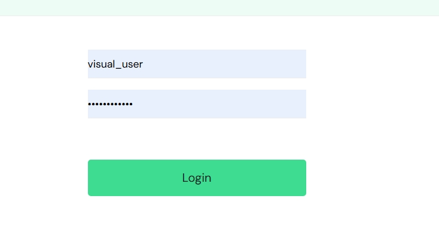
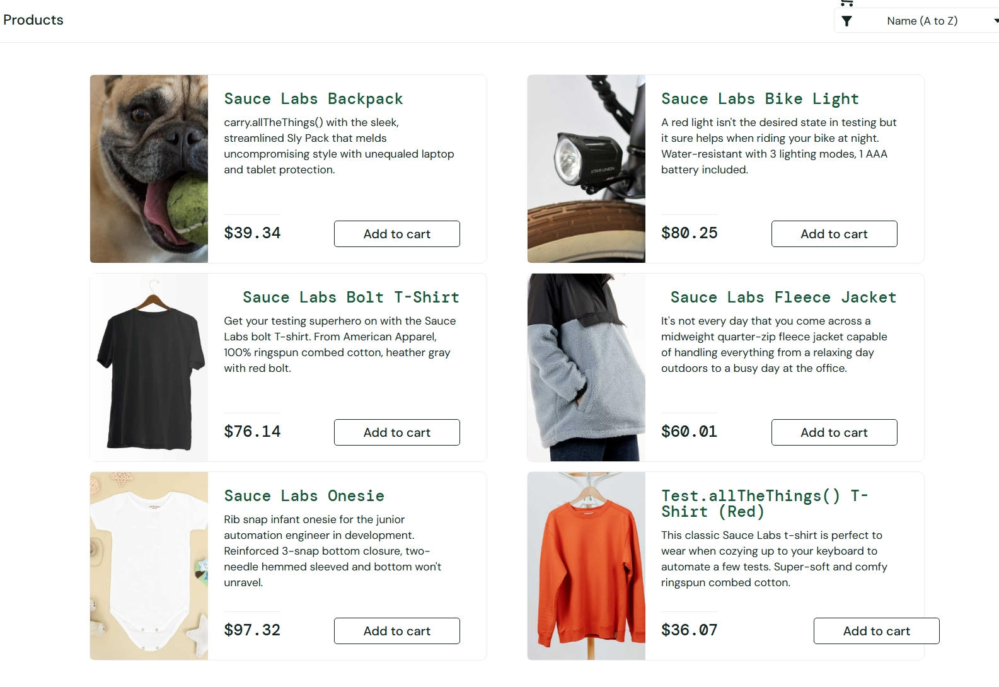
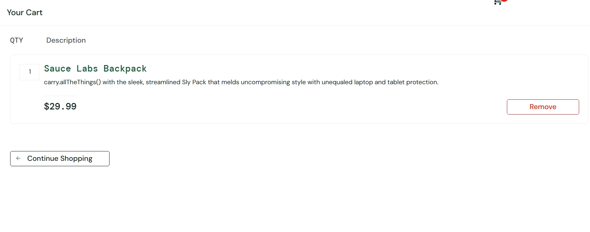
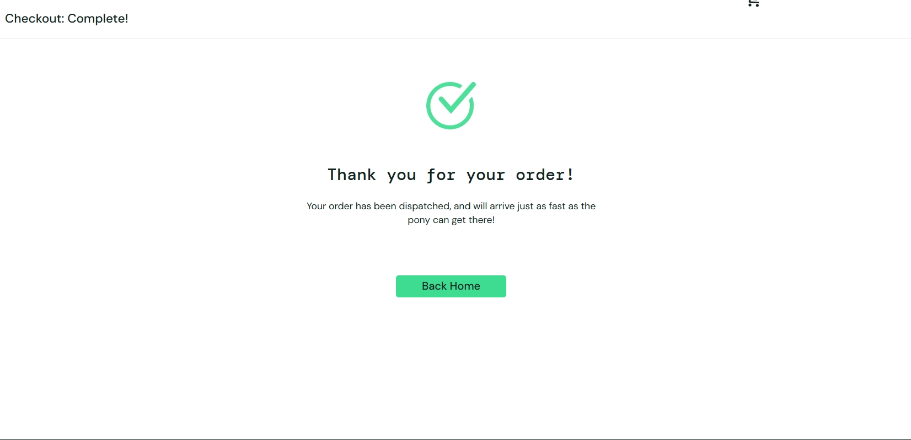

# E-Commerce QA Testing Portfolio

## Overview
This project demonstrates end-to-end manual QA testing of an e-commerce application, including UI testing, API validation, and SQL data verification.

## Application Under Test
- SauceDemo (Practice E-commerce Application)

## Scope
- Login functionality
- Product catalog
- Add to cart
- Checkout process
- Order confirmation
- Negative testing scenarios

## QA Skills Demonstrated
- Test case design and execution
- Functional and regression testing
- Bug reporting and defect tracking
- API testing using Postman
- SQL data validation
- Root cause analysis

## Tools Used
- Postman
- PostgreSQL (SQL)
- GitHub
- Chrome Browser

## Test Execution Summary
All core user flows including login, cart, and checkout were tested and passed successfully.

A usability-related defect was identified in checkout field validation and documented in the bug reports section.

## Screenshots

### Login Page

### Products Page

### Cart Page

### Order Confirmation

## API Testing
Postman collection included in the `api-testing` folder demonstrating API validation, request execution, and response verification.

## SQL Data Validation
SQL queries are included to validate sample e-commerce order data, identify missing totals, detect invalid orders, and ensure data integrity.

## Project Structure
test-plan/
user-stories/
test-cases/
bug-reports/
screenshots/
api-testing/
sql-validation/

## Goal
To simulate real-world QA testing experience and demonstrate a complete QA workflow from requirement analysis to defect reporting and data validation.
